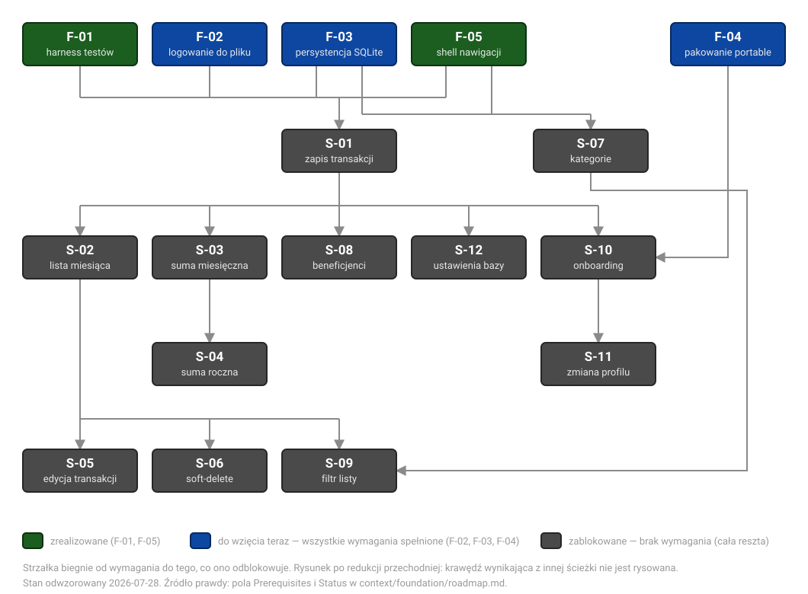

# Graf zależności roadmapy

> **Widok pochodny.** Źródłem prawdy są pola `Prerequisites` i `Status` w
> `context/foundation/roadmap.md`. Ten plik nic nie ustala — tylko rysuje to, co tam stoi.
> Gdy roadmapa się zmieni, rysunek **nie zaktualizuje się sam**; przerysuj albo skasuj.
>
> Stan odwzorowany: **2026-07-28** (po archiwizacji F-01).

## Zasada rysowania: redukcja przechodnia

Krawędź rysujemy tylko wtedy, gdy **nie wynika** z innej ścieżki. Jeśli `C` wymaga `A` i `B`,
a `B` samo wymaga `A`, to strzałka `A → C` znika — przepływ i tak przechodzi przez `B`.

Graf pokazuje więc **bezpośrednich poprzedników**, a nie pełne domknięcie zależności.
Odczyt jest za to obarczony jednym warunkiem: „wymaga" jest przechodnie. `S-05` wymaga też
`S-01`, mimo że nie ma tam strzałki — dziedziczy to przez `S-02`.

## Trzy klasy stanu

Klasa jest **wyliczana z grafu**, a nie przepisywana z kolumny `Status` roadmapy:

| Klasa | Kolor | Kryterium | Pozycje |
|-------|-------|-----------|---------|
| zrealizowane | zielony | `status: done` w roadmapie | F-01, F-05 |
| do wzięcia teraz | niebieski | wszystkie wymagania wstępne spełnione | F-02, F-03, F-04 |
| zablokowane | szary | co najmniej jedno wymaganie niespełnione | S-01 … S-12 (wszystkie 12) |

**Żaden wycinek nie jest dziś osiągalny** — nawet S-07, któremu brakuje wyłącznie F-03.
Cała dostępna praca leży w fundamentach.

Ta klasyfikacja **różni się** od kolumny `Status` w roadmapie: tam S-03 i S-04 noszą
`blocked`, a pozostałe wycinki `proposed`. Tamten podział mówi o czymś innym (przyczyny
w blokach pozycji); tutaj liczy się wyłącznie osiągalność z dzisiejszego stanu.

`S-01` jest north star roadmapy — na rysunku wygląda jak każdy inny zablokowany węzeł,
bo pod względem osiągalności nim jest.

## Graf

Strzałka biegnie **od wymagania do tego, co ono odblokowuje**. Groty stoją wyłącznie na
wejściach do ramek; magistrale i zjazdy są bez grotów, żeby było widać, gdzie przepływ się
kończy, a gdzie linia tylko biegnie.

Dwa skrzyżowania bez połączenia są przy tym układzie nieuniknione: magistrala zbiegająca
do `S-01` przecina prawe odnóże `F-03`, a pionowy kanał `S-07 → S-09` przecina poziome
wejście `F-04` do `S-10`.

## Jak to edytować

Rysunek to `assets/roadmap-graph.svg` — osobny plik osadzony referencją, a nie wklejony inline jako
`<svg>` w treści markdownu. Powód jest praktyczny: GitHub **sanityzuje** inline SVG w plikach
`.md` i wyciąłby go bez śladu. Referencja renderuje się w podglądzie IntelliJ, na GitHubie
i w przeglądarce.

Współrzędne są w pliku wprost, w czytelnych warstwach. Siatka, na której stoi rysunek:

| Warstwa | `y` ramek | Zawartość |
|---------|-----------|-----------|
| 0 — fundamenty | 30 | F-01, F-02, F-03, F-05, F-04 |
| 1 | 170 | S-01, S-07 |
| 2 | 310 | S-02, S-03, S-08, S-12, S-10 |
| 3 | 450 | S-04, S-11 |
| 4 | 590 | S-05, S-06, S-09 |

Ramki mają 150×56, a poziome magistrale biegną na `y` = 128 (do S-01), 150 (do S-07),
270 (S-01 → warstwa 2) i 550 (S-02 → liście). Dodanie węzła sprowadza się do wstawienia
`<rect>` plus dwóch `<text>` i podpięcia go do właściwej magistrali.

## Klucz nazw

| ID | Nazwa pełna | Klasa | Wymaga (bezpośrednio, po redukcji) |
|----|-------------|-------|------------------------------------|
| F-01 | Harness testów + testowalna warstwa domeny | zrealizowane | — |
| F-02 | Logowanie do pliku | do wzięcia | — |
| F-03 | Przenośna persystencja danych (SQLite) | do wzięcia | — |
| F-04 | Przenośne pakowanie aplikacji | do wzięcia | — |
| F-05 | Szkielet nawigacji (app-shell + sidebar) | zrealizowane | — |
| S-01 | Zapis pierwszej transakcji do bazy (north star) | zablokowane | F-01, F-02, F-03, F-05 |
| S-02 | Lista transakcji bieżącego miesiąca | zablokowane | S-01 |
| S-03 | Podsumowanie miesięczne | zablokowane | S-01 |
| S-04 | Podsumowanie roczne | zablokowane | S-03 |
| S-05 | Edycja transakcji | zablokowane | S-02 |
| S-06 | Soft-delete transakcji | zablokowane | S-02 |
| S-07 | Zarządzanie kategoriami | zablokowane | F-03, F-05 |
| S-08 | Zarządzanie beneficjentami | zablokowane | S-01 |
| S-09 | Filtr listy transakcji | zablokowane | S-02, S-07 |
| S-10 | Onboarding z portable media | zablokowane | S-01, F-04 |
| S-11 | Zmiana aktywnego profilu w sesji | zablokowane | S-10 |
| S-12 | Ustawienia — baza i lokalizacja pliku danych | zablokowane | S-01 |

## Krawędzie usunięte przez redukcję

Te zależności **nadal obowiązują** — po prostu nie mają własnej strzałki, bo przepływ
prowadzi do nich inną drogą. Wypisane, żeby nie wyglądały na przeoczenie przy porównaniu
z polami `Prerequisites` w roadmapie:

| Usunięta krawędź | Dlaczego zbędna |
|------------------|-----------------|
| `S-01 → S-05` | S-05 wymaga też S-02, a S-02 wymaga S-01 |
| `S-01 → S-06` | S-06 wymaga też S-02, a S-02 wymaga S-01 |
| `F-03 → S-12` | S-12 wymaga też S-01, a S-01 wymaga F-03 |

Pozostałe 18 krawędzi jest nieredukowalnych.

## Co z tego wynika

- **Cała dostępna praca to trzy fundamenty: F-02, F-03, F-04.** Nic poza nimi nie jest dziś
  do wzięcia — każdy wycinek czeka na co najmniej jedno niespełnione wymaganie.
- **F-03 jest najgęstszym węzłem.** Wchodzi bezpośrednio do S-01 i S-07, a przez S-01 —
  do całej reszty. Zrobienie go samego odblokowuje S-07 (bo F-05 już jest) i zbliża S-01.
- **S-01 potrzebuje jeszcze dwóch fundamentów** — F-02 i F-03. Dopiero one otwierają
  north star i, przez niego, dziesięć kolejnych wycinków.
- **F-04 zasila wyłącznie S-10.** Najdalej odsunięty od ścieżki krytycznej; jako jedyny
  z trójki „do wzięcia" nie przybliża S-01.
- **Poza dwoma korzeniami (S-01, S-07) graf jest drzewem.** Jedyne dodatkowe zbiegi to
  S-09 (S-02 + S-07) i S-10 (S-01 + F-04).

## Znane rozbieżności

**Outcome F-01 obiecuje więcej, niż dowieziono.** Roadmapa opisuje F-01 jako „logika domeny
i agregacji testowalna headless"; powstał sam harness. Ziarno domeny przeszło do S-01,
a headless jest niemożliwy na JavaFX 25 (brak buildu Monocle). Zastrzeżenie stoi we wpisie
`## Done` roadmapy oraz w `test-plan.md` §3 i §7. Czytaj zielone `F-01` na rysunku jako
„harness gotowy", nie „domena gotowa".